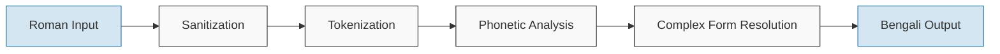

# Obadh Engine

A linguistically accurate Roman to Bengali transliteration engine designed as a modern successor to Avro Phonetic Keyboard.

## Quick Start for Developers

```bash
# Clone the repository
git clone https://github.com/yourusername/obadh_engine.git
cd obadh_engine

# First time setup: Install required tools and dependencies
rustup target add wasm32-unknown-unknown # Required for WASM builds
cargo install wasm-pack # Install wasm-pack tool if not already installed
cd www && npm install && cd .. # Install Node.js dependencies for the web interface

# Run the transliterator with sample text
cargo run --bin obadh -- "ami banglay gan gai"

# Try the debug mode with performance metrics
cargo run --bin obadh -- --debug "ami banglay gan gai"

# Run tests
cargo test

# Build WASM and start development mode with auto-reload
./build.sh dev

# Or build everything and start a production-ready server
./build.sh start
```

## Overview

Obadh Engine is a Rust-based transliteration system designed to convert Roman text to Bengali according to phonetic rules. It aims to provide accurate and natural-sounding transliterations with high fidelity to Bengali linguistic principles, while maintaining a clean, modern, and maintainable codebase.

As a conceptual successor to Avro Phonetic Keyboard—which revolutionized Bengali typing by making it accessible to everyone—Obadh Engine carries the torch forward with improved efficiency, flexibility, and modern software engineering practices. While Avro was a groundbreaking milestone for Bengali computing, its aging codebase necessitates a modern alternative that can power the next generation of Bengali typing tools.

## Philosophy

Obadh Engine is built on these core principles:

1. **Deterministic Transliteration**: The engine uses deterministic phonetic rules rather than machine learning approaches, ensuring consistent and predictable results.

2. **ML/DL-Free Core**: We've intentionally kept the core engine free from machine learning dependencies. This allows downstream projects to choose their own ML/DL models for auto-complete and other enhanced features while using our robust transliteration engine as a foundation.

3. **Linguistic Accuracy**: The project prioritizes linguistic fidelity to Bengali rules over simplified approximations.

4. **Modularity**: The codebase is designed to be integrated into other projects as a library or used as a standalone application.

## Features

The engine implements several key capabilities:

- Tokenization of Roman text into meaningful phonetic units
- Implementation of Bengali orthographic rules, including vowel-consonant interactions
- Support for diacritical marks and special characters in Bengali
- Numerical and symbolic character handling
- Complex character sequence transliteration
- Library and command-line interfaces
- WebAssembly (WASM) support for web applications
- Modern web interface with real-time transliteration
- Memory-efficient data structures and algorithm implementations
- Dark mode support with system preference detection
- Real-time performance metrics in WebAssembly
- Toggle for viewing raw JSON output in debug/verbose modes

## Working Principle

The transliteration process follows a well-defined pipeline:



1. **Sanitization**: Input text is validated and cleaned
2. **Tokenization**: Text is segmented into words, whitespace, and punctuation
3. **Phonetic Analysis**: Words are analyzed into phonetic components
4. **Complex Form Resolution**: Phonetic units are combined according to Bengali orthographic rules
5. **Bengali Output**: The final transliterated text is generated

## Development

### Running the CLI Tool

You can use `cargo run` to run the binary during development:

```bash
# Run the obadh binary
cargo run --bin obadh -- [OPTIONS] [TEXT]
```

Note: The `--` separator is required to pass arguments to the binary rather than to Cargo itself.

Examples:

```bash
# Transliterate text
cargo run --bin obadh -- "ami banglay gan gai"

# Use debug mode with performance metrics
cargo run --bin obadh -- --debug "ami banglay gan gai"

# Use verbose mode with pretty JSON output
cargo run --bin obadh -- --verbose --pretty "ami banglay gan gai"

# Run benchmark
cargo run --bin obadh -- --benchmark 10 "ami banglay gan gai"

# Run benchmark with JSON output
cargo run --bin obadh -- --benchmark 10 --debug "ami banglay gan gai"
```

## Web Interface

The engine comes with a powerful web interface called "অবাধ খেলাঘর" (Obadh Playground) that lets you test the transliteration in real-time directly in your browser.

### Running the Web Interface

```bash
# Quick development mode with file watching and auto-reload
./build.sh dev

# Or build everything manually:

# Build the WASM package
./build.sh wasm

# Build the CSS
./build.sh css

# Start the web server
./build.sh serve
```

The web interface features:

- Real-time transliteration as you type
- Multiple display modes (Simple, Debug, Verbose)
- Real-time performance metrics and detailed token analysis
- Responsive design that works across devices
- Support for Bengali fonts through Google Fonts
- Dark mode with system preference detection and toggle
- Raw JSON output display toggle with syntax highlighting
- Tailwind CSS for modern styling and responsive design

### Web Integration

The WASM module can be easily integrated into any web application:

```javascript
import init, { ObadhaWasm } from './obadh_engine.js';

async function transliterate(text) {
  await init();
  const engine = new ObadhaWasm();
  const bengaliText = engine.transliterate(text);
  return bengaliText;
}

// Example usage
transliterate("ami banglay gan gai").then(result => {
  console.log(result); // আমি বাংলায় গান গাই
});
```

For advanced usage with performance metrics:

```javascript
import init, { ObadhaWasm, TransliterationOptions } from './obadh_engine.js';

async function transliterateWithMetrics(text) {
  await init();
  const engine = new ObadhaWasm();
  const options = new TransliterationOptions();
  options.debug = true;  // Enable performance metrics
  
  const result = engine.transliterate_with_options(text, options);
  return result;
}

// Example usage
transliterateWithMetrics("ami banglay gan gai").then(result => {
  console.log(result.output); // আমি বাংলায় গান গাই
  console.log(`Total processing time: ${result.performance.total_ms.toFixed(2)} ms`);
});
```

## Library Usage

To use Obadh Engine as a library in your Rust project, add it to your `Cargo.toml`:

```toml
[dependencies]
obadh_engine = { git = "https://github.com/yourusername/obadh_engine.git" }
```

Then use it in your code:

```rust
use obadh_engine::ObadhEngine;

fn main() {
    // Create a new engine instance
    let engine = ObadhEngine::new();
    
    // Transliterate Roman text to Bengali
    let bengali = engine.transliterate("ami banglay gan gai");
    
    println!("{}", bengali); // আমি বাংলায় গান গাই
}
```

## CLI Interface

### The `obadh` Command

The main transliteration command-line interface:

```bash
# Basic usage (outputs plain Bengali text)
cargo run --bin obadh -- "ami banglay gan gai"
# Output: আমি বাংলায় গান গাই

# Process a file
cat input.txt | cargo run --bin obadh

# Get help
cargo run --bin obadh -- --help

# Show version
cargo run --bin obadh -- --version
```

#### Command-line Options

- `-h, --help`: Show help information
- `-V, --version`: Show version information
- `-d, --debug`: Output information in JSON format with basic performance metrics
- `-v, --verbose`: Output detailed information in JSON format including token analysis
- `-p, --pretty`: Pretty-print the JSON output (only used with --debug or --verbose)
- `-b, --benchmark [N]`: Run benchmark with N iterations (default: 1)

### Project Structure

- `src/engine/`: Core engine components
  - `tokenizer.rs`: Text tokenization logic
  - `transliterator.rs`: Main transliteration system
  - `sanitizer.rs`: Input text sanitization
- `src/definitions/`: Bengali character and rule definitions
- `src/wasm/`: WebAssembly bindings and web-specific functionality
- `src/bin/`: Binary executables
  - `obadh.rs`: Main CLI application
- `www/`: Web interface files
  - `index.html`: Main web application
  - `css/`: Stylesheets
  - `js/`: JavaScript modules and WASM files
- `tests/`: Test cases for the engine

### Building

The project includes a streamlined build script to simplify common tasks:

```bash
# Clean build artifacts
./build.sh clean

# Build the WASM package
./build.sh wasm

# Build the Tailwind CSS
./build.sh css

# Start the development server
./build.sh serve

# Start development mode with file watching (recommended for development)
./build.sh dev

# Build everything and start the server (for production)
./build.sh start
```

All commands are designed to handle signals properly, so you can press CTRL+C to gracefully stop any running server process.

### Version Information

The project uses Cargo's package version as a single source of truth:

```rust
// Single source of version - using the crate version from Cargo.toml
const VERSION: &str = env!("CARGO_PKG_VERSION");
```

This ensures that all version references throughout the code are synchronized with the version defined in Cargo.toml.

## Web Interface Development

For frontend developers who want to work on the web interface specifically, here's how to get set up:

### First-Time Setup

1. Make sure you have installed:
   - [Node.js and npm](https://nodejs.org/) (v14 or later recommended)
   - [Rust](https://www.rust-lang.org/tools/install) and [wasm-pack](https://rustwasm.github.io/wasm-pack/installer/)

2. Install the npm dependencies:
   ```bash
   cd www
   npm install
   ```

3. The project uses:
   - Tailwind CSS for styling
   - http-server for local development
   - Alpine.js for UI interactivity
   - highlight.js for syntax highlighting

### Development Workflow

The recommended workflow for web development is:

```bash
# Start development mode with CSS watching and auto-reload
./build.sh dev

# If you're only making CSS/HTML changes and don't need to rebuild the WASM:
cd www
npm run watch & npm run serve
```

When using development mode:
- CSS changes will be automatically compiled
- Browser refreshes will show your changes immediately
- You can press CTRL+C to stop the server cleanly

### Project Structure for Web Interface

- `www/` - Root directory for web interface
  - `index.html` - Main application HTML
  - `css/` - CSS files
    - `input.css` - Source Tailwind CSS
    - `styles.css` - Compiled CSS (don't edit directly)
  - `js/` - JavaScript files and WASM
  - `package.json` - npm configuration

### Build Commands Related to Web Interface

```bash
# Build the WASM package only
./build.sh wasm

# Build the CSS only
./build.sh css

# Start the web server only (no builds)
./build.sh serve
```