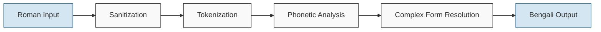

# Obadh Engine

A linguistically accurate Roman to Bengali transliteration engine designed as a modern successor to Avro Phonetic Keyboard.

## Quick Start for Developers

```bash
# Clone the repository
git clone https://github.com/yourusername/obadh_engine.git
cd obadh_engine

# Run the transliterator with sample text
cargo run --bin obadh -- "ami banglay gan gai"

# Try the debug mode with performance metrics
cargo run --bin obadh -- --debug "ami banglay gan gai"

# Run tests
cargo test
```

## Overview

Obadh Engine is a Rust-based transliteration system designed to convert Roman text to Bengali according to phonetic rules. It aims to provide accurate and natural-sounding transliterations with high fidelity to Bengali linguistic principles, while maintaining a clean, modern, and maintainable codebase.

As a conceptual successor to Avro Phonetic Keyboard—which revolutionized Bengali typing by making it accessible to everyone—Obadh Engine carries the torch forward with improved efficiency, flexibility, and modern software engineering practices. While Avro was a groundbreaking milestone for Bengali computing, its aging codebase necessitates a modern alternative that can power the next generation of Bengali typing tools.

## Philosophy

Obadh Engine is built on these core principles:

1. **Deterministic Transliteration**: The engine uses deterministic phonetic rules rather than machine learning approaches, ensuring consistent and predictable results.

2. **ML/DL-Free Core**: We've intentionally kept the core engine free from machine learning dependencies. This allows downstream projects to choose their own ML/DL models for auto-complete and other enhanced features while using our robust transliteration engine as a foundation.

3. **Linguistic Accuracy**: The project prioritizes linguistic fidelity to Bengali rules over simplified approximations.

4. **Modularity**: The codebase is designed to be integrated into other projects as a library or used as a standalone application.

## Features

The engine implements several key capabilities:

- Tokenization of Roman text into meaningful phonetic units
- Implementation of Bengali orthographic rules, including vowel-consonant interactions
- Support for diacritical marks and special characters in Bengali
- Numerical and symbolic character handling
- Complex character sequence transliteration
- Library and command-line interfaces
- Memory-efficient data structures and algorithm implementations

## Working Principle

The transliteration process follows a well-defined pipeline:



1. **Sanitization**: Input text is validated and cleaned
2. **Tokenization**: Text is segmented into words, whitespace, and punctuation
3. **Phonetic Analysis**: Words are analyzed into phonetic components
4. **Complex Form Resolution**: Phonetic units are combined according to Bengali orthographic rules
5. **Bengali Output**: The final transliterated text is generated

## Development

### Running the CLI Tool

You can use `cargo run` to run the binary during development:

```bash
# Run the obadh binary
cargo run --bin obadh -- [OPTIONS] [TEXT]
```

Note: The `--` separator is required to pass arguments to the binary rather than to Cargo itself.

Examples:

```bash
# Transliterate text
cargo run --bin obadh -- "ami banglay gan gai"

# Use debug mode with performance metrics
cargo run --bin obadh -- --debug "ami banglay gan gai"

# Use verbose mode with pretty JSON output
cargo run --bin obadh -- --verbose --pretty "ami banglay gan gai"

# Run benchmark
cargo run --bin obadh -- --benchmark 10 "ami banglay gan gai"

# Run benchmark with JSON output
cargo run --bin obadh -- --benchmark 10 --debug "ami banglay gan gai"
```

## Library Usage

To use Obadh Engine as a library in your Rust project, add it to your `Cargo.toml`:

```toml
[dependencies]
obadh_engine = { git = "https://github.com/yourusername/obadh_engine.git" }
```

Then use it in your code:

```rust
use obadh_engine::ObadhEngine;

fn main() {
    // Create a new engine instance
    let engine = ObadhEngine::new();
    
    // Transliterate Roman text to Bengali
    let bengali = engine.transliterate("ami banglay gan gai");
    
    println!("{}", bengali); // আমি বাংলায় গান গাই
}
```

## CLI Interface

### The `obadh` Command

The main transliteration command-line interface:

```bash
# Basic usage (outputs plain Bengali text)
cargo run --bin obadh -- "ami banglay gan gai"
# Output: আমি বাংলায় গান গাই

# Process a file
cat input.txt | cargo run --bin obadh

# Get help
cargo run --bin obadh -- --help

# Show version
cargo run --bin obadh -- --version
```

#### Command-line Options

- `-h, --help`: Show help information
- `-V, --version`: Show version information
- `-d, --debug`: Output information in JSON format with basic performance metrics
- `-v, --verbose`: Output detailed information in JSON format including token analysis
- `-p, --pretty`: Pretty-print the JSON output (only used with --debug or --verbose)
- `-b, --benchmark [N]`: Run benchmark with N iterations (default: 1)

### Project Structure

- `src/engine/`: Core engine components
  - `tokenizer.rs`: Text tokenization logic
  - `transliterator.rs`: Main transliteration system
  - `sanitizer.rs`: Input text sanitization
- `src/definitions/`: Bengali character and rule definitions
- `src/bin/`: Binary executables
  - `obadh.rs`: Main CLI application
- `tests/`: Test cases for the engine

### Version Information

The project uses Cargo's package version as a single source of truth:

```rust
// Single source of version - using the crate version from Cargo.toml
const VERSION: &str = env!("CARGO_PKG_VERSION");
```

This ensures that all version references throughout the code are synchronized with the version defined in Cargo.toml.